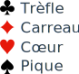
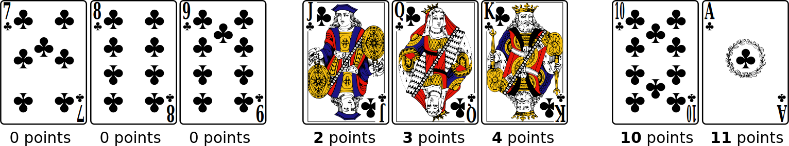
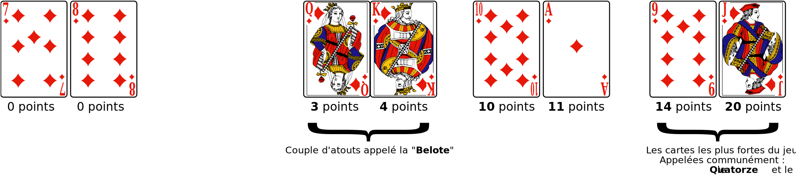
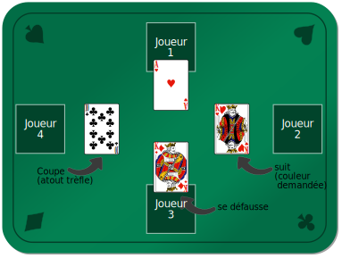

# Règles de la Coinche

La coinche (ou belote coinchée) est un jeu à 4 joueurs, en équipe.

Les joueurs de la même équipe jouent en face l'un de l'autre.

## Cartes

Il y a quatre couleurs :

Pour chaque couleur, il y a 8 cartes, du 7 à l'As, dont la force et les points
sont, dans l'ordre :

À chaque manche, une couleur va être décidée comme étant l'« **Atout** ».
L'ordre et la valeur des cartes change alors, le **valet** et le **neuf**
passent devant :

La somme des cartes vaut 152 points, auxquels s'ajoutent 10 points pour le
dernier pli (« dix de der »), soient **un total de 162 points**.

## Étape 1: les enchères

* Chaque joueur (en commençant par le 1er joueur) va miser pour son équipe le
  nombre de points qu'il pense faire, en choisissant une couleur d'atout.

* Les enchères commencent à 82 points, soit la moitié du jeu, et montent de 10
  points en 10 points (ou plus).

* Dès que 4 joueurs d'affilée passent, les enchères prennent fin.
  * si aucune enchère n'a été faite, une nouvelle main est distribuée
  * sinon, la dernière enchère est prise en compte, et le jeu commence, à
  l'atout sélectionné.

Par exemple, un joueur qui fait une enchère à 100 Trèfle, fait le pari que son
équipe va réaliser 100 points si l'atout est trèfle.

Comme le total des points vaut 162 points, on peut enchérir jusqu'à 160 (sauf
exceptions, voir "belote" et "capot").

## Étape 2: le jeu de carte

Comme les 4 joueurs ont 8 cartes en mains, il y a 8 plis de 4 cartes.

### Les plis

Le 1er joueur va poser une carte; les autres joueurs, dans l'ordre, doivent
également poser une carte en suivant les règles suivantes :

* si le joueur possède dans sa main la couleur demandée (♥, ♦, ♣ ou ♠), il doit
  en jouer;
* sinon, s'il a de l'atout, il doit jouer une carte à la couleur de l'atout (ce
  qui s'appelle *couper*);
* sinon, il peut jouer n'importe quelle autre couleur (ce qui s'appelle se
  *défausser*).

Le fait de **couper** (jouer un atout sur une autre couleur) remporte le pli;
sinon c'est la carte la plus forte de la couleur du pli qui remporte.

Le joueur qui pose la carte la plus forte remporte le pli, puis c'est à lui de
commencer, et ainsi de suite jusqu'au huitième et dernier pli.

* **Exception 1** : un joueur n'est pas obligé de couper si son partenaire est
  maître à la couleur demandée
* **Exception 2** : quand de l'atout est joué, le joueur suivant est obligé de
  *monter* (mettre une carte plus forte), s'il en a une.

---

Par exemple, si l'enchère est 100 ♣ :

* Joueur 1, choisi de jouer As de ♥
* Joueur 2, choisi de jouer Roi de ♥
* Joueur 3, n'a pas de ♥, ni de ♣ (atout), choisit de jouer un Roi de ♦
* Joueur 4, n'a pas de ♥, est obligé de couper, et joue alors son 10 de ♣

Ici, le joueur 4, comme il a coupé, remporte le pli.

Note: Le joueur 3, s'il avait eu de l'atout, n'aurait pas été obligé de couper,
car son partenaire (joueur 1) était maître, à ce moment là, avec l'as de ♥.

---

## Étape 3 : Fin de la manche (8 plis)

Quand les joueurs ont posé toutes leurs cartes, c'est la fin de la manche, les
points sont comptés.

**Important** : le dernier pli rapporte 10 points, que l'on appelle Dix de der.

### Enchère réussie

Si l'équipe qui a remporté les enchères a réussi son pari, elle fait les points annoncés + les points faits.

L'équipe adverse remporte les points qu'elle a fait elle aussi.

---

Par exemple, si l'enchère est 100 ♣ pour l'équipe "Joueur1 & Joueur3", et que
ces derniers on réalisé 122 points:

* Ils gagnent donc 122 + 100 = **222 points**.
* L'équipe adverse gagne **40 points** (162 - 122).

---

### Enchère échouée

Si l'équipe qui a remporté les enchères a raté son pari, elle fait zéro.

L'équipe adverse remporte les points annoncés + 160.

---

Par exemple, si l'enchère est 100 ♣ pour l'équipe "Joueur1 & Joueur2", et que
ces derniers on réalisé 96 points:

* Ils ne gagnent donc **aucun point**
* L'équipe adverse gagne 160 + 100 = **260 points**

On dit que l'équipe qui a raté son enchère « est dedans ».

## Fin du jeu

Dès qu'une équipe atteint 2000 points (révolus), le jeu s'arrête, l'équipe
gagnante étant celle avec le plus de points.

## La Coinche !

Lors de la phase d'enchères, à tout moment, un joueur peut Coincher l'équipe
adverse.

Cela veut dire « Je parie que vous ne ferez pas cette enchère ! »

Dans ce cas, les enchères sont immédiatement stoppées, et le jeu démarre dans la
foulée.

Les points de réussite ou de défaites sont alors **doublés**.

## Sans Atout (SA), Tout Atout (TA)

En plus d'annoncer une des quatre couleurs (♥, ♦, ♣ ou ♠), un joueur peut faire
une enchère de deux autres types :

* Sans Atout (SA): Aucune couleur n'est considérée comme de l'atout (de fait, on
  ne peut pas couper).
* Tout Atout (TA): Toutes les couleurs sont considérées comme de l'atout (de
  fait, on ne peut pas couper non plus).
  * Tous les valets sont des "vingts"
  * Tous les 9 sont des "quatorze"
  * On est obligé de monter sur la carte précédemment jouée, pour toutes les
    couleurs !

Dans les deux cas, le total des points ne fait bien évidemment pas 162; un
"produit en croix" par rapport à 152 est alors effectué à la fin de la manche,
et le dernier pli vaut toujours 10 points.

## La Belote

La Dame et le Roi, à la couleur de l'atout, sont appelée la « Belote » .

Les cartes ont les même valeur que d'habitude (3 et 4 points).

Cependant, si un même joueur a les deux cartes (couple royal à l'atout) dans sa
main, il peut les annoncer au moment de les jouer, et cela lui rapporte alors
**20 points**.

Si le joueur qui annonce la belote est dans l'équipe qui a fait l'enchère, ces
20 points aident à la réussir !

On peut annonce la dame ou le roi en premier, cela n'a pas d'impact.

---

Par exemple, si l'enchère est 100 ♣ pour l'équipe "Joueur1 & Joueur3".

Le joueur 1 a la Dame et le Roi de ♣.

* Il joue la dame, annonce "Belote";
* Plus tard, il joue le roi, annonce "Rebelote";
* Alors 20 points seront ajoutés pour le calcul de la manche, ils n'auront donc
  plus que 80 points à faire pour réussir leur enchère (100).

*Astuce* : il est parfois intéressant de ne pas annoncer la belote, pour éviter
d'indiquer aux adversaire que l'on a l'autre carte du couple royal.

*Note* : il n'y a pas de belote ni à Sans-Atout, ni à Tout-Atout.

---

## Variante : comptage des points ou non

Une variante consiste à ne compter que l'annonce, pas les points effectués.

Ceci entraîne un jeu plus long (de fait, souvent joué en 1000 points au lieu de
2000).

C'est intéressant car cela force les joueurs à enchérir plus haut pour gagner
plus de points.

Cependant, cela ignore les points faits par l'équipe en défense, qui fait zéro
dans tous les cas si l'enchère est réussie.
