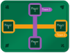
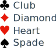
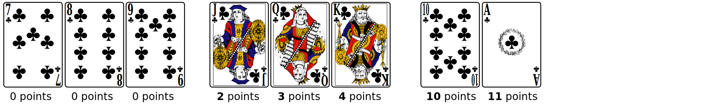
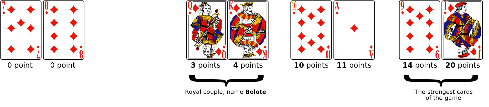
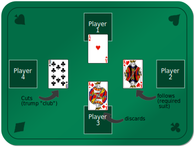

# Rules of Coinche

Coinche (or "belote coinchée") is a 4-players game, in teams.

Players of the same team play one in front of the other.

## Cards

There are 4 suits :

For each suit, there are 8 cards, from 7 to Ace, for which points and strengh
are, in order:

For each round, a suit will be decided as being the “**Atout**” suit.
The order and strengh of the cards then change, the **Jack** and the **9** being
the strongest:

The sum of the cards is a total of 152 points, plus 10 for the last trick (“Dix
de Der”), for a grand **total of 162 points**.

## Step 1: the bidding

* Each player (starting with the first player) will bid for his team the number
  of points he hopes doing, while choosing a trump suit.

* Bidding starts at 82 points, meaning half of the game points, and goes up 10
  by 10 (or more)

* As soon as 4 players pass, the bidding stops :
  * if no bid has been done, a new hand is dealt,
  * otherwise, the last bid is validated, and the game starts, with the chosen
  trump suit.

Par exemple, un joueur qui fait une enchère à 100 Trèfle, fait le pari que son
équipe va réaliser 100 points si l'atout est trèfle.
For example, un player bidding 100 Club, bets that his team will take 100 points
if the trump is Club.

As the grand total of the points are 162, we can bid up to 160 (actually more,
see "Belote" and "capot").

## Step 2: the card game

As the 4 players have 8 cards in hand, there are 8 tricks of 4 cards.

### The tricks

This first players will play a card; other players, in order, must play a card,
while following these rules:

* if the player has in his hand the required suit (♥, ♦, ♣ ou ♠), they must
  play this suit;
* else, if they have a trump card, they must play one (which is called *cut*);
* otherwise, they can play any other suit (which is called *discard*).

**Cutting** (playing a trump on another suit) wins the trick; otherwise the
strongest card of the initial trick's suit is winnning.

Whoever played the strongest card wins the trick, and must start the next trick;
this continue until the last (eighth) trick.

* **Exception 1** : a player is not required to cut if their partner is has the
  strongest card in the current trick
* **Exception 2** : when trump is played, the next player must play a higher
  trump if they have one (if they can't follow the suit).

---

For example, if the bid is 100 ♣:

* Player 1, chooses to play Ace ♥
* Player 2, chooses to play King ♥
* Player 3, doesn't have any ♥, nor any ♣ (trump), chooses to play King ♦
* Player 4, doesn't have any ♥, must cut, and plays 10 ♣

Here, since the player 4 has cut, they win the trick.

Note : Player 3, if he had a trump in his hand, would not be requided to cut,
since hist partner currently had the strongest card (Ace ♥).

---

## Step 3 : end of the round (8 tricks)

When players have played all their cards, it's the end of the round, each team
count the points.

**Important** : the last trick earns 10 points, which is named “Dix de der”.

### Bid successful

If the team which won the bidding succeeds, it wins the bid points + the points
done in the game.

The opposing team wins the point it did, too.

---

For example, if the bid is 100 ♣ for the team "Player1 & Player3", and they have
won 122 points:

* They score 122 + 100 = **222 points**.
* The opposing team scores **40 points** (162 - 122).

---

### Bid fails

If the team which won the bidding succeeds, it wins no point.

The opposing team wons the bid points + 160.

---

For example, if the bid is 100 ♣ for the team "Player1 & Player3", and they have
won 96 points:

* They score **zero point**.
* The opposing team scores 160 + 100 = **260 points**.

## End of the game

As soon as a team reaches 2000 points, the game stops; the winning team being
the one with the more points.

## The Coinche !

During the bidding phase, at any time, a player can "Coinche" (Double) the
opposing team.

It means “I bet you wont win this bid !”.

In this case, the bidding phase is immediately stopped, and the game starts.

The scoring (win or fail) will then be doubled.

## No-Trump (Sans-Atout - SA), All-Trump (Tout-Atout - TA)

Along the standard suits to bid (♥, ♦, ♣ or ♠), a player can bid with :
* No Trump (SA) : no suit is considered as trump (so, one cannot cut)
* All Trump (TA) : all suit are considered as trump (so, one cannot cut, too)
  * All the Jacks have a value of 20
  * All the 9 have a value of 14
  * All player have to play a higher card than the previous card, for all suits !

In both cases, the total is not 162 points; a division is done to put the total
to 152, then the last trick still earns 10 points.

## The Belote

The Queen and the King, for the trump suit, are called the “Belote”.

These cards still have the same value (3 and 4 points).

But, is a player have both cards (the trump royal couple) in his hand, he can
declare them whe, playing them, and this will earn his team **20 points**.

If the player declaring the Belote is in the team who won the bidding, these 20
points help them to won the contract !

We can play (and declare) the Queen or the King first, there is no incidence.

---

For example, if the bid is 100 ♣ for the team "Player1 & Player3".

Player1 has the Queen and the King of ♣.

* He plays the Queen, declares "Belote" ;
* Later, he plays the King, declares "Rebelote" ;
* Then 20 points will be added when counting his points for the round, his team will then have only 80 points to do to win the contract (instead of 100 ♣).

*Tip* : sometimes it's a good idea not to declare the Belote to not give
indication you have the other card of the royal couple.

*Note* : There is no Belote when playing "All-Trump" or "No-Trump".

